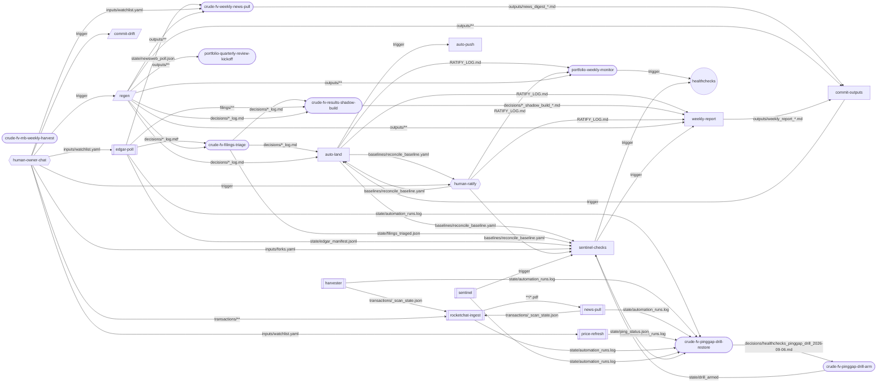

# OPERATING.md — how this project runs, and where you come in

Written 2026-09-11 after the owner asked "what is the surface for engaging with this project".
One page. What runs by itself, what an agent does on a schedule, what only you do, and the one
surface you watch. Times are given in UTC with the machine-local (Pacific) launchd hour beside
them; the desktop app shows its own task times in your display zone.

## The one surface: your inbox

You read email. Nothing else is required.

| Email | When | What it means | What you do |
|---|---|---|---|
| `[crude-fv] daily digest` | every day after the sentinel run (15:15 UTC / 08:15 machine-local) | status, sent on OK days too; its absence is the tell | nothing |
| `[crude-fv] PAGE: n flag(s)` | only when YOUR action is needed | each line carries `ACTION: OWNER …` saying what to do | do the named action, or nothing if it says "(optional)" |
| weekly report | Saturdays (catches up on Monday if the Mac slept) | the week's surface changes, band hits, fork docket | read it |
| healthchecks.io alert | when the sentinel did not ping for a day | the automation itself is down | open a chat in this repo and say "sentinel did not ping" |
| `[portfolio] digest: …` | Fridays after the close, from the governor's monitor | nothing triggered; weights in band | nothing |
| `[portfolio] PAGE: …` | only when a tripwire fired, a weight left its band, a falsifier moved, the producer seam changed a holding's tier or label, or the quarterly review pack is ready | each line ends `ACTION: OWNER — …` (usually: open a mini-review) | open a chat inside `portfolio-governance` and do the named action |
| healthchecks.io alert (governor) | when the Friday monitor did not run | the monitor slipped or aborted | open a chat in `portfolio-governance` and say "monitor did not run" |

A page never asks for agent-class work. Filings triage, earnings-date sweeps, unreadable-filing
recovery and watchlist pair rebases ride the digest and the agent tasks below; the routing table
is `inputs/notify.yaml` and `tests/test_notify.py` reds the build if a page-class tag has no
owner action text.

Most pages are of the form "object within three business days or it runs" (`FORK-EXECUTABLE`,
policy `inputs/forks.yaml`). Silence executes the recommendation. To object, open a chat in this
repo and say so in one line.

## Layer 1 — runs by itself (launchd on this Mac; no app, no agent, no LLM)

| Job | Cadence | Does |
|---|---|---|
| `edgar-poll` | hourly at :20 | stages new EDGAR / MFN / Oslo / HKEX arrivals into `inputs/filings/` + the manifest |
| `rocketchat-ingest` | 14:00 UTC (07:00 local) | pulls the broker-chat feed into the archive |
| `sentinel` | 15:15 UTC (08:15 local) | all checks → weekly report if owed → **auto-land** explained drift (`promote land`) → **auto-push** → digest email + any page + healthchecks ping |
| `price-refresh` | 01:30 UTC (18:30 local) | writes the day's price vintage; the next sentinel lands it as its own commit |
| `news-pull` | Sat 15:00 UTC (08:00 local) | the scanner half of the weekly news sweep |
| `harvester` | Sat 16:00 UTC (09:00 local) | the vendored `shipping_harvester` S&P scan into the print queue |

The scripts are `scripts/*_cron.sh`; secrets come from `~/.config/crude-tanker-fv.env`. These run
whether or not the desktop app is open, as long as the Mac is awake.

## Layer 2 — agent tasks (Claude scheduled tasks; run only while the desktop app is open)

Each task starts cold from this repo's CLAUDE.md and its own SKILL.md. If the app was closed when
one was due, it runs at the next launch. A task that writes a tracked file commits it in the same
run: an uncommitted write is "non-drift dirt" and freezes the next morning's auto-land and
auto-push until someone commits (caught 2026-09-12: the Saturday weekly report and the drill
doc). Producer side:

| Task | Cadence | Does |
|---|---|---|
| `crude-fv-filings-triage` | daily, after the sentinel | dispositions every arrival in the 48h window (record-only / calendar / print / refresh-trigger / unreadable), appends `decisions/filings_triage_log.md`, acks the ledger so it stops flagging; pages you only for an `owner` disposition |
| `crude-fv-results-shadow-build` | daily, after triage | for a name whose results are out but whose sheet is a quarter behind: drafts the pair as `*.yaml.draft` with citations, values it in a throwaway worktree (`scripts/shadow_regen.sh`), writes `decisions/<t>_shadow_build_<date>.md` with a WOULD-LAND / WOULD-HOLD verdict; never the live pair (pilot: TEN, 2026-09-11 — you compare one shadow to a hand build, then decide whether to lift the 2026-07-03 drafts-only rule) |
| `crude-fv-mb-weekly-harvest` | Saturday morning | the four MB Shipbrokers weeklies from Gmail into `inputs/research_mb/` |
| `crude-fv-weekly-news-pull` | Saturday morning | the web-reading half of the news sweep into a dated digest |
| drill one-shots | as scheduled | arm / restore the healthchecks ping-gap drill (marker file) |

Governor side (repo `../portfolio-governance`):

| Task | Cadence | Does |
|---|---|---|
| `portfolio-weekly-monitor` | Friday after the US close | reads the live book and the producer's `outputs/book_scorecard.json`; flags any tripwire, tier or label change; writes `monitor/log.md`; never trades |
| `portfolio-quarterly-review-kickoff` | 26th of Mar / Jun / Sep / Dec | prepares the review pack; you decide |

## The seam: producer → governor is a file, not a conversation

The sentinel lands and pushes `outputs/book_scorecard.json` (schema major version 2) every day.
The governor's Friday monitor reads it and flags a tier or position-label change on any holding.
Nothing about your positions is decided in this repo; nothing about valuation is decided in that one.

## Layer 3 — you (the only things that are yours)

- **Rule on a page.** Open a chat in the repo the page names and say one line.
- **Object to a fork, or don't.** Silence after three business days executes the recommendation.
- **Submit orders.** Claude drafts IBKR order instructions in the governor repo; you click submit.
- **Decide at the quarterly review.** The kickoff pack is analysis; the decisions are yours.
- **Permissions.** Only you edit `.claude/settings.json`. Today the ask-tier files are the
  watchlist, transactions and the FFA curve, plus `git push` from a chat (the cron pushes on its
  own). An unattended agent stalls on an ask-tier action, so a promotion that touches those files
  happens in a chat with you present, or you loosen the rule per file class.
- **Re-authenticate** a surface when a `REAUTH-NEEDED` page names one.

## What still needs the hand crank (honest list, 2026-09-11)

- A balance-sheet build when a results filing lands (TEN Q2 is waiting on its 6-K).
- Packet refreshes that end in a watchlist / transactions / FFA edit.
- The baseline ratify (`scripts/ratify_baseline.sh`) — human-committed by design.
- Order submission, and anything that changes account settings at the broker.

## Where to open a chat

- Producer questions, rulings, sheet builds: a session **inside** `~/Projects/crude-tanker-fv`.
- Brokerage, orders, reviews: a session **inside** `~/Projects/portfolio-governance`.
- Never a session in `~/Projects` itself: it loads neither repo's CLAUDE.md and neither
  permission file, so it has no operating rules and the IBKR connector is neither allowed nor
  denied by design. The two repos meet through git and the scorecard, not a shared chat.
- Compaction inside a session does not require a new one; start fresh at a clean boundary if you
  like, in the repo for the work.

## The declared graph (machine map = this map)

Every unattended node, what it reads and writes, who commits its tracked writes, and the edges
derived from that. `graph.yaml` is the source; the block below is its render, and the build
fails if they disagree or if a node writes a tracked file with no committer.

<!-- graph:begin -->
Rendered from `graph.yaml` by `python -m crude_tanker_fv.graph render --write`; `python -m crude_tanker_fv.graph check` and `tests/test_graph.py` keep it honest. Do not edit by hand.

| Node | Kind | Runs | Reads | Writes | Committed by |
|---|---|---|---|---|---|
| `edgar-poll` | launchd | hourly at :20 (machine-local) | `inputs/watchlist.yaml`, `external:EDGAR`, `external:HKEX`, `external:Oslo NewsWeb`, `external:MFN` | `state/edgar_manifest.jsonl`, `state/edgar_poll.json`, `state/hkex_poll.json`, `state/newsweb_poll.json`, `inputs/filings/**`, `inputs/filings/_manifest.json` … | none |
| `rocketchat-ingest` | launchd | 07:00 machine-local (14:00 UTC) | `external:Rocket.Chat`, `inputs/research_pareto/**`, `inputs/market_data/transactions/**` | `state/rocketchat_ingest.json`, `inputs/research_pareto/**/*.pdf`, `inputs/research_pareto/_manifest.json`, `inputs/market_data/transactions/_scan_state.json`, `outputs/sp_print_candidates.md`, `outputs/ffa_ocr_queue.md` … | none |
| `price-refresh` | launchd | 18:30 machine-local (01:30 UTC next day) | `inputs/watchlist.yaml`, `external:Yahoo chart API` | `inputs/market_data/prices_daily.yaml`, `state/price_refresh.log`, `state/automation_runs.log` | commit-drift |
| `news-pull` | launchd | Saturday 08:00 machine-local | `external:Rocket.Chat`, `inputs/research_pareto/**` | `inputs/research_pareto/_manifest.json`, `inputs/market_data/transactions/_scan_state.json`, `outputs/sp_print_candidates.md`, `outputs/ffa_ocr_queue.md`, `state/automation_runs.log` | none |
| `harvester` | launchd | Saturday 09:00 machine-local | `external:broker archive sites`, `shipping_harvester/**` | `shipping_harvester/data/**`, `inputs/market_data/transactions/_scan_state.json`, `outputs/sp_print_candidates.md`, `state/harvester_cron.log`, `state/automation_runs.log` | none |
| `sentinel` | launchd | 08:15 machine-local (15:15 UTC) | — | `state/sentinel_cron.log`, `state/automation_runs.log` | none |
| `sentinel-checks` | lane | every sentinel run | `inputs/**`, `outputs/**`, `state/**`, `baselines/reconcile_baseline.yaml`, `inputs/notify.yaml`, `inputs/forks.yaml` … | `state/sentinel_state.json`, `state/sentinel.log`, `state/ping_status.json`, `state/notify_sent.log`, `state/notify_down.log`, `state/paged_once` | none |
| `weekly-report` | lane | every sentinel run; writes only when a Saturday report is owed (is_due) | `outputs/book_scorecard.json`, `outputs/book_scorecard.md`, `state/**`, `inputs/reweight_triggers.yaml`, `decisions/*_shadow_build_*.md`, `RATIFY_LOG.md` | `outputs/weekly_report_*.md` | commit-outputs |
| `commit-outputs` | lane | every sentinel run, after weekly-report | `outputs/weekly_report_*.md`, `outputs/news_digest_*.md` | — | self |
| `auto-land` | lane | every sentinel run, after commit-outputs | `baselines/reconcile_baseline.yaml`, `decisions/*_log.md`, `outputs/book_scorecard.json`, `state/last_run.json`, `scripts/drift_files.txt` | `baselines/reconcile_baseline.yaml`, `RATIFY_LOG.md` | self |
| `auto-push` | lane | every sentinel run, last | `scripts/drift_files.txt` | — | none |
| `commit-drift` | script | on demand from a chat (drift-list files are routine dirt; nothing schedules this) | `scripts/drift_files.txt` | — | self |
| `regen` | script | on demand from a chat, after any determinant change | `inputs/**`, `src/**` | `outputs/**`, `decisions/*_log.md`, `state/last_run.json` | human-owner-chat |
| `crude-fv-filings-triage` | scheduled-task | daily 11:45 (app display zone) | `state/edgar_manifest.jsonl`, `inputs/filings/**`, `decisions/filings_triage_log.md`, `WORKFLOWS.md` | `decisions/filings_triage_log.md`, `PLAN.md`, `decisions/*_log.md`, `state/filings_triaged.json` | self |
| `crude-fv-results-shadow-build` | scheduled-task | daily 12:15 (app display zone) | `inputs/earnings_calendar.yaml`, `decisions/filings_triage_log.md`, `inputs/filings/**`, `inputs/research_issuer/**`, `inputs/balance_sheets/*.yaml`, `inputs/fleet_manifests/*.yaml` … | `inputs/balance_sheets/*.yaml.draft`, `inputs/fleet_manifests/*.yaml.draft`, `decisions/*_shadow_build_*.md`, `PLAN.md` | self |
| `crude-fv-mb-weekly-harvest` | scheduled-task | Saturday 08:30 (app display zone) | `external:Gmail (from:mbshipbrokers.com)` | `inputs/research_mb/**/*.pdf` | none |
| `crude-fv-weekly-news-pull` | scheduled-task | Saturday 09:00 (app display zone) | `inputs/watchlist.yaml`, `inputs/archive_gaps.yaml`, `state/newsweb_poll.json`, `outputs/news_digest_*.md`, `external:issuer feeds + trade press` | `outputs/news_digest_*.md` | commit-outputs |
| `crude-fv-pinggap-drill-arm` | scheduled-task | one-shot 2026-09-12 09:05 (fired 14:07 EDT) | `decisions/healthchecks_pinggap_drill_2026-09-06.md` | `state/drill_armed`, `decisions/healthchecks_pinggap_drill_2026-09-06.md` | human-owner-chat |
| `crude-fv-pinggap-drill-restore` | scheduled-task | one-shot 2026-09-14 18:45 (moved from 15:20 — the page is due ~17:15) | `external:Gmail (from:healthchecks.io)`, `state/ping_status.json`, `state/automation_runs.log` | `decisions/healthchecks_pinggap_drill_2026-09-06.md` | self |
| `portfolio-weekly-monitor` | scheduled-task | Friday 17:00 (app display zone) | `outputs/book_scorecard.json`, `RATIFY_LOG.md`, `external:IBKR account`, `governance:CADENCE.md`, `governance:holdings/*.md`, `governance:funnels/register.md` | `governance:monitor/log.md`, `governance:monitor/outbox/*-monitor.md` | human-owner-chat |
| `portfolio-quarterly-review-kickoff` | scheduled-task | 26th of Mar/Jun/Sep/Dec 09:00 (app display zone) | `external:IBKR account`, `governance:holdings/*.md`, `governance:reviews/*.md`, `outputs/book_scorecard.json` | `governance:monitor/outbox/*-quarterly-kickoff.md` | human-owner-chat |
| `human-owner-chat` | human | when a page names an action, or at will | `external:inbox` | `inputs/watchlist.yaml`, `inputs/market_data/transactions/**`, `inputs/market_data/ffa_forward_curve.yaml`, `inputs/forks.yaml`, `.claude/settings.json` | self |
| `human-ratify` | human | owner-run, on an explained move auto-land cannot take (a flip toward BUY, an unannotated row) | `baselines/reconcile_baseline.yaml` | `baselines/reconcile_baseline.yaml`, `RATIFY_LOG.md` | self |
| `healthchecks` | external | dead-man timer (producer: period 1d + grace 30h; governor: weekly) | `external:ping` | — | none |

Shapes: `[[launchd]]` · `[lane]` · `([scheduled task])` · `[/script/]` · `{{human}}` · `((external))`. Edges are files (labelled) or declared triggers; reads declared as a whole directory (`inputs/**`) count for the downstream list below but are not drawn.

**What is downstream of each unattended node** (derived; if it is late or wrong, these are affected):

- `edgar-poll` → `auto-land`, `auto-push`, `commit-outputs`, `crude-fv-filings-triage`, `crude-fv-pinggap-drill-arm`, `crude-fv-pinggap-drill-restore`, `crude-fv-results-shadow-build`, `crude-fv-weekly-news-pull`, `healthchecks`, `human-ratify`, `portfolio-quarterly-review-kickoff`, `portfolio-weekly-monitor`, `regen`, `sentinel-checks`, `weekly-report`
- `rocketchat-ingest` → `auto-land`, `auto-push`, `commit-outputs`, `crude-fv-filings-triage`, `crude-fv-pinggap-drill-arm`, `crude-fv-pinggap-drill-restore`, `crude-fv-results-shadow-build`, `crude-fv-weekly-news-pull`, `healthchecks`, `human-ratify`, `news-pull`, `portfolio-quarterly-review-kickoff`, `portfolio-weekly-monitor`, `regen`, `sentinel-checks`, `weekly-report`
- `price-refresh` → `auto-land`, `auto-push`, `commit-outputs`, `crude-fv-filings-triage`, `crude-fv-pinggap-drill-arm`, `crude-fv-pinggap-drill-restore`, `crude-fv-results-shadow-build`, `crude-fv-weekly-news-pull`, `healthchecks`, `human-ratify`, `portfolio-quarterly-review-kickoff`, `portfolio-weekly-monitor`, `regen`, `sentinel-checks`, `weekly-report`
- `news-pull` → `auto-land`, `auto-push`, `commit-outputs`, `crude-fv-filings-triage`, `crude-fv-pinggap-drill-arm`, `crude-fv-pinggap-drill-restore`, `crude-fv-results-shadow-build`, `crude-fv-weekly-news-pull`, `healthchecks`, `human-ratify`, `portfolio-quarterly-review-kickoff`, `portfolio-weekly-monitor`, `regen`, `rocketchat-ingest`, `sentinel-checks`, `weekly-report`
- `harvester` → `auto-land`, `auto-push`, `commit-outputs`, `crude-fv-filings-triage`, `crude-fv-pinggap-drill-arm`, `crude-fv-pinggap-drill-restore`, `crude-fv-results-shadow-build`, `crude-fv-weekly-news-pull`, `healthchecks`, `human-ratify`, `news-pull`, `portfolio-quarterly-review-kickoff`, `portfolio-weekly-monitor`, `regen`, `rocketchat-ingest`, `sentinel-checks`, `weekly-report`
- `sentinel` → `auto-land`, `auto-push`, `commit-outputs`, `crude-fv-pinggap-drill-arm`, `crude-fv-pinggap-drill-restore`, `healthchecks`, `human-ratify`, `portfolio-weekly-monitor`, `sentinel-checks`, `weekly-report`
- `sentinel-checks` → `auto-land`, `auto-push`, `commit-outputs`, `crude-fv-pinggap-drill-arm`, `crude-fv-pinggap-drill-restore`, `healthchecks`, `human-ratify`, `portfolio-weekly-monitor`, `weekly-report`
- `weekly-report` → `auto-land`, `auto-push`, `commit-outputs`, `crude-fv-pinggap-drill-arm`, `crude-fv-pinggap-drill-restore`, `healthchecks`, `human-ratify`, `portfolio-weekly-monitor`, `sentinel-checks`
- `commit-outputs` → `auto-land`, `auto-push`, `crude-fv-pinggap-drill-arm`, `crude-fv-pinggap-drill-restore`, `healthchecks`, `human-ratify`, `portfolio-weekly-monitor`, `sentinel-checks`, `weekly-report`
- `auto-land` → `auto-push`, `commit-outputs`, `crude-fv-pinggap-drill-arm`, `crude-fv-pinggap-drill-restore`, `healthchecks`, `human-ratify`, `portfolio-weekly-monitor`, `sentinel-checks`, `weekly-report`
- `auto-push` → nothing declared
- `crude-fv-filings-triage` → `auto-land`, `auto-push`, `commit-outputs`, `crude-fv-pinggap-drill-arm`, `crude-fv-pinggap-drill-restore`, `crude-fv-results-shadow-build`, `crude-fv-weekly-news-pull`, `healthchecks`, `human-ratify`, `portfolio-quarterly-review-kickoff`, `portfolio-weekly-monitor`, `regen`, `sentinel-checks`, `weekly-report`
- `crude-fv-results-shadow-build` → `auto-land`, `auto-push`, `commit-outputs`, `crude-fv-filings-triage`, `crude-fv-pinggap-drill-arm`, `crude-fv-pinggap-drill-restore`, `crude-fv-weekly-news-pull`, `healthchecks`, `human-ratify`, `portfolio-quarterly-review-kickoff`, `portfolio-weekly-monitor`, `regen`, `sentinel-checks`, `weekly-report`
- `crude-fv-mb-weekly-harvest` → `auto-land`, `auto-push`, `commit-outputs`, `crude-fv-filings-triage`, `crude-fv-pinggap-drill-arm`, `crude-fv-pinggap-drill-restore`, `crude-fv-results-shadow-build`, `crude-fv-weekly-news-pull`, `healthchecks`, `human-ratify`, `portfolio-quarterly-review-kickoff`, `portfolio-weekly-monitor`, `regen`, `sentinel-checks`, `weekly-report`
- `crude-fv-weekly-news-pull` → `auto-land`, `auto-push`, `commit-outputs`, `crude-fv-pinggap-drill-arm`, `crude-fv-pinggap-drill-restore`, `healthchecks`, `human-ratify`, `portfolio-weekly-monitor`, `sentinel-checks`, `weekly-report`
- `crude-fv-pinggap-drill-arm` → `auto-land`, `auto-push`, `commit-outputs`, `crude-fv-pinggap-drill-restore`, `healthchecks`, `human-ratify`, `portfolio-weekly-monitor`, `sentinel-checks`, `weekly-report`
- `crude-fv-pinggap-drill-restore` → `auto-land`, `auto-push`, `commit-outputs`, `crude-fv-pinggap-drill-arm`, `healthchecks`, `human-ratify`, `portfolio-weekly-monitor`, `sentinel-checks`, `weekly-report`
- `portfolio-weekly-monitor` → `healthchecks`
- `portfolio-quarterly-review-kickoff` → nothing declared

**Nodes that need a drift-only tree** (any uncommitted tracked non-drift write degrades them): `price-refresh`, `sentinel-checks`, `auto-land`, `auto-push`, `regen`.
<!-- graph:end -->

## The page vocabulary (what a page can ask of you)

| Tag | Your action |
|---|---|
| `SURFACE-INCOHERENT` | a guard contradicted the published surface; the agent halted — read the named check and rule |
| `FILING-OVERDUE` | the issuer has not filed past its window — chase, or hold the name on its prior sheet |
| `TRIGGER-DUE` | an observable you registered is due — record its outcome, or say "agent" |
| `FORK-EXECUTABLE` | optional: object today, else the recommendation runs |
| `DIRTY-TOO-LONG` | the tree has been mid-surgery for days — finish, stash, or say "discard" |
| `REAUTH-NEEDED` | re-authenticate the named surface |
| `FETCH-FAILED` (in reporting season, two runs) | check the network or the credentials file |

Everything else in an email is information.
