# OPERATING.md — how this project runs, and where you come in

Written 2026-09-11 after the owner asked "what is the surface for engaging with this project".
One page. What runs by itself, what an agent does on a schedule, what only you do, and the one
surface you watch. Times are Eastern with UTC beside them. The Mac is on Eastern time, but launchd
fires each job three hours after its plist hour (since the 2026-08-17 reboot: launchd's calendar monitor
keeps the Pacific zone it booted in; the next reboot or the Nov 1 DST change moves every job again and
`graph check` R7 fires); the graph at the end records both. A slot the Mac slept through fires once at
wake, one job or several; `graph check` prints that as a note, the first job to run on its slot afterwards
clears it, and R7 fails only when the next job is off by the same offset. The desktop app shows its task
times in your display zone.

## The one surface: your inbox

You read email. Nothing else is required.

| Email | When | What it means | What you do |
|---|---|---|---|
| `[crude-fv] daily digest` | every day after the sentinel run (11:15 ET / 15:15 UTC) | status, sent on OK days too; its absence is the tell | nothing |
| `[crude-fv] PAGE: n flag(s)` | only when YOUR action is needed | each line carries `ACTION: OWNER …` saying what to do | do the named action, or nothing if it says "(optional)" |
| weekly report | Saturdays (catches up on Monday if the Mac slept) | the week's surface changes, band hits, fork docket | read it |
| healthchecks.io alert | when the sentinel did not ping for a day | the automation itself is down | open a chat in this repo and say "sentinel did not ping" |
| `[portfolio] digest: …` | Fridays after the close, from the governor's monitor | nothing triggered; weights in band | nothing |
| `[portfolio] PAGE: …` | only when a tripwire fired, a weight left its band, a falsifier moved, the producer seam changed a holding's tier or label, or the quarterly review pack is ready | each line ends `ACTION: OWNER — …` (usually: open a mini-review) | open a chat inside `portfolio-governance` and do the named action |
| healthchecks.io alert (governor) | when the Friday monitor did not run | the monitor slipped or aborted | open a chat in `portfolio-governance` and say "monitor did not run" |

A page never asks for agent-class work. Filings triage, earnings-date sweeps, unreadable-filing
recovery and watchlist pair rebases ride the digest and the agent tasks below; the routing table
is `inputs/notify.yaml` and `tests/test_notify.py` reds the build if a page-class tag has no
owner action text.

Most pages are of the form "a recommendation was registered; it executes after <date> unless you
object" (`FORK-OPENED`, policy `inputs/forks.yaml`) — one page per fork, at its OPENING, so the
objection window is real. The window closing is a digest line, and the daily executor runs it. To
object, open a chat in this repo and say so in one line. A line marked NEEDS A CHAT is a fork whose
recommendation includes a code change; the executor never touches those — open a chat when you want
it landed.

## Layer 1 — runs by itself (launchd on this Mac; no app, no agent, no LLM)

| Job | Cadence | Does |
|---|---|---|
| `edgar-poll` | hourly at :20 | stages new EDGAR / MFN / Oslo / HKEX arrivals into `inputs/filings/` + the manifest |
| `rocketchat-ingest` | 10:00 ET (14:00 UTC; plist 07:00) | pulls the broker-chat feed into the archive |
| `sentinel` | 11:15 ET (15:15 UTC; plist 08:15) | all checks → weekly report if owed → **auto-land** explained drift (`promote land`) → **auto-push** → digest email + any page + healthchecks ping |
| `price-refresh` | 21:30 ET (01:30 UTC; plist 18:30) | writes the day's price vintage; the next sentinel lands it as its own commit |
| `news-pull` | Sat 11:00 ET (15:00 UTC; plist 08:00) | the scanner half of the weekly news sweep |
| `harvester` | Sat 12:00 ET (16:00 UTC; plist 09:00) | the vendored `shipping_harvester` S&P scan into the print queue |

The scripts are `scripts/*_cron.sh`; secrets come from `~/.config/crude-tanker-fv.env`. These run
whether or not the desktop app is open, as long as the Mac is awake.

## Layer 2 — agent tasks (Claude scheduled tasks; run only while the desktop app is open)

Each task starts cold from this repo's CLAUDE.md and its own SKILL.md. If the app was closed when
one was due, it runs at the next launch. A task that writes a tracked file commits it in the same
run: an uncommitted write is "non-drift dirt" and freezes the next morning's auto-land and
auto-push until someone commits (caught 2026-09-12: the Saturday weekly report and the drill
doc). Producer side:

| Task | Cadence | Does |
|---|---|---|
| `crude-fv-filings-triage` | daily, after the sentinel | dispositions every arrival in the 48h window (record-only / calendar / print / refresh-trigger / unreadable), appends `decisions/filings_triage_log.md`, acks the ledger so it stops flagging; pages you only for an `owner` disposition |
| `crude-fv-results-shadow-build` | daily, after triage | for a name whose results are out but whose sheet is a quarter behind: drafts the pair as `*.yaml.draft` with citations, values it in a throwaway worktree (`scripts/shadow_regen.sh`), writes `decisions/<t>_shadow_build_<date>.md` with a WOULD-LAND / WOULD-HOLD verdict; never the live pair (pilot: TEN, 2026-09-11 — you compare one shadow to a hand build, then decide whether to lift the 2026-07-03 drafts-only rule) |
| `crude-fv-mb-weekly-harvest` | Saturday morning | the four MB Shipbrokers weeklies from Gmail into `inputs/research_mb/` |
| `crude-fv-weekly-news-pull` | Saturday morning | the web-reading half of the news sweep into a dated digest |
| `crude-fv-trigger-check-draft` | Thursday 09:00 | drafts the weekly geopolitics trigger check (both legs, dated primaries, a proposed disposition) to `decisions/trigger_check_<card>_<due>.draft.md` and commits it; the 11:15 page names the draft; you record it with `/record-trigger-check <card> <due>` |
| drill one-shots | as scheduled | arm / restore the healthchecks ping-gap drill (marker file) |

Governor side (repo `../portfolio-governance`):

| Task | Cadence | Does |
|---|---|---|
| `portfolio-weekly-monitor` | Friday after the US close | reads the live book and the producer's `outputs/book_scorecard.json`; flags any tripwire, tier or label change; writes `monitor/log.md`; never trades |
| `portfolio-quarterly-review-kickoff` | 26th of Mar / Jun / Sep / Dec | prepares the review pack; you decide |

## The seam: producer → governor is a file, not a conversation

The sentinel lands and pushes `outputs/book_scorecard.json` (schema major version 2) every day.
The governor's Friday monitor reads it and flags a tier or position-label change on any holding.
Nothing about your positions is decided in this repo; nothing about valuation is decided in that one.

## Layer 3 — you (the only things that are yours)

- **Rule on a page.** Open a chat in the repo the page names and say one line.
- **Object to a fork, or don't.** Silence after three business days executes the recommendation.
- **Submit orders.** Claude drafts IBKR order instructions in the governor repo; you click submit.
- **Decide at the quarterly review.** The kickoff pack is analysis; the decisions are yours.
- **Permissions.** Only you edit `.claude/settings.json`. Since 2026-09-13 the watchlist,
  transactions and the FFA curve are allow-tier (your edit), so the lanes write them behind guards;
  what stays ask-tier is `git push` from a chat (the cron pushes on its own), `curl` and `launchctl`.
- **Re-authenticate** a surface when a `REAUTH-NEEDED` page names one.

## Standing rulings (so a settled question stops reappearing as owed)

- **Unattended tasks may read the web themselves** (owner, 2026-09-18). A scheduled task's web
  domains are granted in ITS OWN frontmatter `allowed-tools` — the fork-executor / shadow-build /
  trigger-check-draft precedent — not by widening `.claude/settings.json`, which holds the issuer
  and filing domains and stays your file. Adding a domain to a task is ordinary agent work, not a
  decision for you. (A task with no `allowed-tools` line is not blocked either: the Saturday news
  sweep has none and fetches fine.)

## What still needs the hand crank (honest list, 2026-09-13)

- **Installing the fork executor task** (once): the app's classifier refused the agent's registration;
  paste `scripts/scheduled_tasks/crude-fv-fork-executor.SKILL.md` into a new scheduled task. Until then a
  fork past its window sits un-executed; the sentinel lists it in the digest as FORK-EXECUTABLE (a needs_code fork
  always waits for a chat).
- A balance-sheet build when a results filing lands (TEN Q2: compare the shadow to a hand build once,
  then lift the drafts-only rule).
- Print promotion and FFA-curve promotion lanes: allow-tier now, guards next (in progress).
- Order submission, and anything that changes account settings at the broker.

## Where to open a chat

- Producer questions, rulings, sheet builds: a session **inside** `~/Projects/crude-tanker-fv`.
- Brokerage, orders, reviews: a session **inside** `~/Projects/portfolio-governance`.
- Never a session in `~/Projects` itself: it loads neither repo's CLAUDE.md and neither
  permission file, so it has no operating rules and the IBKR connector is neither allowed nor
  denied by design. The two repos meet through git and the scorecard, not a shared chat.
- Compaction inside a session does not require a new one; start fresh at a clean boundary if you
  like, in the repo for the work.

## The declared graph (machine map = this map)

Every unattended node, what it reads and writes, who commits its tracked writes, and the edges
derived from that. `graph.yaml` is the source; the block below is its render, and the build
fails if they disagree or if a node writes a tracked file with no committer.

<!-- graph:begin -->
Rendered from `graph.yaml` by `python -m crude_tanker_fv.graph render --write`; `python -m crude_tanker_fv.graph check` and `tests/test_graph.py` keep it honest. Do not edit by hand.

| Node | Kind | Runs | Reads | Writes | Committed by |
|---|---|---|---|---|---|
| `accepted-publication` | lane | after successful landing; worker catches accepted manual commits | `outputs/book_scorecard.json`, `state/last_run.json`, `baselines/reconcile_baseline.yaml`, `decisions/*_log.md` | `state/publications/**` | none |
| `delivery-worker` | launchd | every five minutes and on load; catches up after sleep | `work_items.yaml`, `inputs/forks.yaml`, `inputs/reweight_triggers.yaml`, `decisions/*_shadow_build_*.json`, `governance:reviews/completed_quarters.json`, `state/publications/**` … | `work_items.yaml`, `state/work_items_observed.json`, `state/publications/**`, `state/delivery/**`, `state/operations/**`, `state/heartbeat/delivery-worker` … | self, governor-seam |
| `governor-seam` | script | each accepted publication and weekly monitor | `producer:state/publications/**`, `monitor/seam_registry.json` | `monitor/state/**`, `monitor/outbox/seam-*.md` | self |
| `edgar-poll` | launchd | hourly at :20 (the minute is unaffected by the launchd +3h hour offset) | `inputs/data_sources.yaml`, `inputs/earnings_calendar.yaml`, `external:EDGAR`, `external:HKEX`, `external:MFN (Oslo NewsWeb mirror)` | `state/edgar_manifest.jsonl`, `state/edgar_poll.json`, `state/hkex_poll.json`, `state/newsweb_poll.json`, `inputs/filings/**`, `state/edgar_poll.log` … | none |
| `rocketchat-ingest` | launchd | 10:00 America/New_York = 14:00 UTC (plist 07:00; launchd +3h) | `external:Rocket.Chat`, `inputs/rocketchat_sources.yaml`, `inputs/research_pareto/**`, `inputs/research_pareto_other/**`, `inputs/ffa_drybulk/**`, `inputs/market_data/transactions/_scan_state.json` | `state/rocketchat_ingest.json`, `state/arrivals.jsonl`, `inputs/research_pareto/**/*.pdf`, `inputs/research_pareto/**/_quarantine/*.reason`, `inputs/ffa_drybulk/**`, `inputs/research_pareto/_manifest.json` … | commit-drift |
| `price-refresh` | launchd | 21:30 America/New_York = 01:30 UTC next day (plist 18:30; launchd +3h) | `inputs/watchlist.yaml`, `inputs/market_data/prices_daily.yaml`, `scripts/drift_files.txt`, `external:Yahoo chart API` | `inputs/market_data/prices_daily.yaml`, `state/price_refresh.log`, `state/price_refresh.err`, `state/heartbeat/price-refresh`, `state/automation_runs.log` | commit-drift |
| `news-pull` | launchd | Saturday 11:00 America/New_York = 15:00 UTC (plist 08:00; launchd +3h) | `external:Rocket.Chat`, `inputs/rocketchat_sources.yaml`, `inputs/research_pareto/**`, `inputs/research_pareto_other/**`, `inputs/ffa_drybulk/**`, `inputs/market_data/transactions/_scan_state.json` … | `state/rocketchat_ingest.json`, `state/arrivals.jsonl`, `inputs/research_pareto/**/*.pdf`, `inputs/research_pareto/**/_quarantine/*.reason`, `inputs/ffa_drybulk/**`, `inputs/research_pareto/_manifest.json` … | commit-drift |
| `harvester` | launchd | Saturday 12:00 America/New_York = 16:00 UTC (plist 09:00; launchd +3h) | `external:broker archive sites`, `shipping_harvester/**` | `shipping_harvester/data/**`, `state/harvester_cron.log`, `state/harvester_cron.err`, `state/heartbeat/harvester`, `state/automation_runs.log` | none |
| `sentinel` | launchd | 11:15 America/New_York = 15:15 UTC (plist 08:15; launchd +3h — state/sentinel_cron.log '=== [sentinel] 2026-09-12 11:15:05'); the five lanes inherit this | — | `state/sentinel_cron.log`, `state/sentinel_cron.err`, `state/heartbeat/sentinel`, `state/automation_runs.log` | none |
| `sentinel-checks` | lane | every sentinel run | `inputs/**`, `outputs/**`, `state/**`, `inputs/notify.yaml`, `inputs/forks.yaml`, `inputs/reweight_triggers.yaml` … | `state/sentinel_state.json`, `state/sentinel.log`, `state/ping_status.json`, `state/notify_sent.log`, `state/notify_down.log`, `state/reauth/*.json` | none |
| `weekly-report` | lane | every sentinel run; writes only when a Saturday report is owed (is_due) | `work_items.yaml`, `state/operations/**`, `state/publications/**`, `state/delivery/**`, `governance:monitor/state/**`, `outputs/**` … | `outputs/weekly_report_*.md`, `state/notify_sent.log`, `state/notify_down.log`, `state/reauth/smtp.json` | commit-outputs |
| `commit-outputs` | lane | every sentinel run, after weekly-report | `outputs/weekly_report_*.md`, `outputs/news_digest_*.md` | — | self |
| `price-leg` | lane | every sentinel run, after commit-outputs and BEFORE auto-land | `inputs/market_data/prices_daily.yaml`, `scripts/drift_files.txt`, `scripts/regen.sh`, `outputs/book_scorecard.json`, `state/last_run.json`, `baselines/reconcile_baseline.yaml` | `inputs/market_data/prices_daily.yaml`, `outputs/**`, `decisions/*_log.md`, `state/regen.out`, `state/annotate.out`, `state/commit_drift.out` … | self |
| `annotate` | script | inside the price-leg lane, from crude-fv-fork-executor step 0b (2026-09-18), or on demand from a chat | `baselines/reconcile_baseline.yaml`, `state/last_run.json`, `outputs/book_scorecard.json`, `inputs/market_data/prices_daily.yaml`, `decisions/*_log.md` | `decisions/*_log.md` | price-leg, crude-fv-fork-executor |
| `auto-land` | lane | every sentinel run after the price-leg lane; ALSO from crude-fv-fork-executor step 0b (owner ruling 2026-09-18) | `baselines/reconcile_baseline.yaml`, `decisions/*_log.md`, `outputs/book_scorecard.json`, `state/last_run.json`, `scripts/drift_files.txt`, `PLAN.md` | `baselines/reconcile_baseline.yaml`, `RATIFY_LOG.md` | self |
| `auto-push` | lane | every sentinel run, last | `scripts/drift_files.txt`, `baselines/reconcile_baseline.yaml`, `state/last_run.json`, `decisions/*_log.md` | — | none |
| `commit-drift` | script | on demand from a chat (drift-list files are routine dirt; nothing schedules this) | `scripts/drift_files.txt`, `state/edgar_manifest.jsonl` | `inputs/filings/_manifest.json` | self |
| `regen` | script | on demand from a chat, after any determinant change | `inputs/**`, `src/**`, `scripts/*_weight_*.py`, `tests/test_outputs_hygiene.py` | `outputs/**`, `decisions/*_log.md`, `state/last_run.json`, `state/read_flag_state.json` | human-owner-chat |
| `preflight` | script | on demand from a chat (the report-day preflight), and as step 1 of crude-fv-results-shadow-build | `inputs/watchlist.yaml`, `inputs/market_data/**`, `inputs/earnings_calendar.yaml`, `inputs/reweight_triggers.yaml`, `inputs/data_sources.yaml`, `inputs/balance_sheets/*.yaml` … | `outputs/refresh_checklist.md` | commit-drift |
| `crude-fv-filings-triage` | scheduled-task | daily 11:45 (app display zone) | `state/edgar_manifest.jsonl`, `state/filings_triaged.json`, `inputs/filings/**`, `decisions/filings_triage_log.md`, `CLAUDE.md`, `WORKFLOWS.md` … | `decisions/filings_triage_log.md`, `PLAN.md`, `decisions/*_log.md`, `state/filings_triaged.json` | self |
| `crude-fv-results-shadow-build` | scheduled-task | daily 12:15 (app display zone) | `inputs/earnings_calendar.yaml`, `inputs/watchlist.yaml`, `inputs/market_data/**`, `state/edgar_manifest.jsonl`, `decisions/filings_triage_log.md`, `inputs/filings/**` … | `inputs/balance_sheets/*.yaml.draft`, `inputs/fleet_manifests/*.yaml.draft`, `decisions/*_shadow_build_*.md`, `decisions/*_shadow_build_*.json`, `PLAN.md`, `outputs/refresh_checklist.md` | self |
| `crude-fv-mb-weekly-harvest` | scheduled-task | Saturday 08:30 (app display zone) | `external:Gmail (from:mbshipbrokers.com)`, `inputs/research_mb/**/*.pdf`, `inputs/data_sources.yaml`, `inputs/**`, `outputs/**`, `state/**` | `inputs/research_mb/**/*.pdf` | none |
| `crude-fv-weekly-news-pull` | scheduled-task | Saturday 09:00 (app display zone) | `inputs/watchlist.yaml`, `inputs/archive_gaps.yaml`, `inputs/data_sources.yaml`, `src/crude_tanker_fv/reconcile.py`, `decisions/*_log.md`, `state/edgar_manifest.jsonl` … | `outputs/news_digest_*.md` | commit-outputs |
| `crude-fv-trigger-check-draft` | scheduled-task | Thursday 09:00 (app display zone; fires ~09:09 with the app's jitter — installed 2026-09-18) — the weekly geopolitics card's due weekday, before the 11:15 EDT sentinel page | `inputs/reweight_triggers.yaml`, `decisions/*_check_*.md`, `decisions/trigger_check_*.draft.md`, `inputs/research_pareto/**`, `inputs/research_mb/**`, `inputs/scenario_inputs.yaml` … | `decisions/trigger_check_*.draft.md` | self |
| `crude-fv-pinggap-drill-arm` | scheduled-task | one-shot 2026-09-12 09:05 (fired 14:07 EDT) | `state/ping_status.json`, `state/automation_runs.log`, `decisions/healthchecks_pinggap_drill_2026-09-06.md` | `state/drill_armed`, `decisions/healthchecks_pinggap_drill_2026-09-06.md` | human-owner-chat |
| `crude-fv-pinggap-drill-restore` | scheduled-task | one-shot 2026-09-14 18:45 (moved from 15:20 — the page is due ~17:15) | `external:Gmail (from:healthchecks.io)`, `state/ping_status.json`, `state/automation_runs.log`, `decisions/healthchecks_pinggap_drill_2026-09-06.md` | `decisions/healthchecks_pinggap_drill_2026-09-06.md`, `state/drill_armed` | self |
| `crude-fv-fork-executor` | scheduled-task | daily 12:45 app-display-zone (fires 12:47; installed by the owner 2026-09-14) | `inputs/forks.yaml`, `decisions/**`, `inputs/**`, `outputs/book_scorecard.json`, `baselines/reconcile_baseline.yaml`, `state/ffa_ocr_curves.json` … | `inputs/**`, `decisions/*_log.md`, `PLAN.md`, `outputs/**`, `state/fork_page.md`, `state/last_run.json` | self |
| `ffa-promote` | script | on demand (the fork executor's step 0, or a chat) | `state/ffa_ocr_curves.json`, `inputs/market_data/ffa_forward_curve.yaml`, `inputs/market_data/twelve_month_tc.yaml`, `inputs/market_data/historical_tce_means.yaml` | `inputs/market_data/ffa_forward_curve.yaml`, `inputs/market_data/twelve_month_tc.yaml`, `decisions/ffa_promotion_*.md` | crude-fv-fork-executor |
| `rebase` | script | on demand (a fork execution, a report-day refresh, or a chat) | `inputs/watchlist.yaml`, `inputs/market_data/prices_daily.yaml` | `inputs/watchlist.yaml`, `inputs/watchlist_rebase_*.yaml.draft` | crude-fv-fork-executor |
| `portfolio-weekly-monitor` | scheduled-task | Friday 17:00 (app display zone) | `outputs/book_scorecard.json`, `RATIFY_LOG.md`, `external:IBKR account`, `external:web search`, `governance:CADENCE.md`, `governance:holdings/*.md` … | `governance:monitor/inbox/**`, `governance:monitor/log.md`, `governance:monitor/outbox/*-monitor.md`, `governance:monitor/state/**` | self |
| `portfolio-quarterly-review-kickoff` | scheduled-task | 26th of Mar/Jun/Sep/Dec 09:00 (app display zone) | `work_items.yaml`, `external:IBKR account`, `governance:CADENCE.md`, `governance:HOLDING_THESIS.md`, `governance:holdings/*.md`, `governance:reviews/*.md` … | `governance:monitor/inbox/**`, `governance:monitor/outbox/*-monitor.md`, `governance:monitor/log.md`, `governance:monitor/state/**` | self |
| `human-owner-chat` | human | when a page names an action, or at will | `external:inbox` | `inputs/**`, `inputs/watchlist.yaml`, `inputs/market_data/transactions/**`, `inputs/market_data/ffa_forward_curve.yaml`, `inputs/forks.yaml`, `.claude/settings.json` … | self |
| `human-ratify` | human | owner-run, on an explained move auto-land cannot take (a flip toward BUY, an unannotated row) | `state/last_run.json`, `PLAN.md` | `baselines/reconcile_baseline.yaml`, `RATIFY_LOG.md` | self |
| `sentinel-lite` | external | daily 12:45 UTC (GitHub Actions, against pushed main) | `inputs/**`, `outputs/**`, `inputs/filings/_manifest.json` | — | none |
| `healthchecks` | external | dead-man timer (producer: period 1d + grace 30h, 7/13 record; governor: spec cron 0 17 * * 5 America/New_York + grace ~6h per analysis/2026-08-09 postmortem — dashboard state UNRECORDED; last governor ping 9/11 WITHHELD, ping.sh midnight-straddle) | `external:ping` | — | none |

Shapes: `[[launchd]]` · `[lane]` · `([scheduled task])` · `[/script/]` · `{{human}}` · `((external))`. Edges are files (labelled) or declared triggers; reads declared as a whole directory (`inputs/**`) count for the downstream list below but are not drawn.

```mermaid
flowchart LR
  accepted_publication["accepted-publication"]
  delivery_worker[["delivery-worker"]]
  governor_seam[/"governor-seam"/]
  edgar_poll[["edgar-poll"]]
  rocketchat_ingest[["rocketchat-ingest"]]
  price_refresh[["price-refresh"]]
  news_pull[["news-pull"]]
  harvester[["harvester"]]
  sentinel[["sentinel"]]
  sentinel_checks["sentinel-checks"]
  weekly_report["weekly-report"]
  commit_outputs["commit-outputs"]
  price_leg["price-leg"]
  annotate[/"annotate"/]
  auto_land["auto-land"]
  auto_push["auto-push"]
  commit_drift[/"commit-drift"/]
  regen[/"regen"/]
  preflight[/"preflight"/]
  crude_fv_filings_triage(["crude-fv-filings-triage"])
  crude_fv_results_shadow_build(["crude-fv-results-shadow-build"])
  crude_fv_mb_weekly_harvest(["crude-fv-mb-weekly-harvest"])
  crude_fv_weekly_news_pull(["crude-fv-weekly-news-pull"])
  crude_fv_trigger_check_draft(["crude-fv-trigger-check-draft"])
  crude_fv_pinggap_drill_arm(["crude-fv-pinggap-drill-arm"])
  crude_fv_pinggap_drill_restore(["crude-fv-pinggap-drill-restore"])
  crude_fv_fork_executor(["crude-fv-fork-executor"])
  ffa_promote[/"ffa-promote"/]
  rebase[/"rebase"/]
  portfolio_weekly_monitor(["portfolio-weekly-monitor"])
  portfolio_quarterly_review_kickoff(["portfolio-quarterly-review-kickoff"])
  human_owner_chat{{"human-owner-chat"}}
  human_ratify{{"human-ratify"}}
  sentinel_lite(("sentinel-lite"))
  healthchecks(("healthchecks"))
  accepted_publication -->|publications/**| delivery_worker
  accepted_publication -->|publications/**| portfolio_quarterly_review_kickoff
  accepted_publication -->|publications/**| weekly_report
  annotate -->|decisions/*_log.md| accepted_publication
  annotate -->|decisions/*_log.md| auto_land
  annotate -->|decisions/*_log.md| auto_push
  annotate -->|decisions/*_log.md| crude_fv_filings_triage
  annotate -->|decisions/*_log.md| crude_fv_results_shadow_build
  annotate -->|decisions/*_log.md| crude_fv_weekly_news_pull
  annotate -->|decisions/*_log.md| weekly_report
  auto_land -->|baselines/reconcile_baseline.yaml| accepted_publication
  auto_land -->|baselines/reconcile_baseline.yaml| annotate
  auto_land -->|baselines/reconcile_baseline.yaml| auto_push
  auto_land -->|baselines/reconcile_baseline.yaml| crude_fv_fork_executor
  auto_land -->|RATIFY_LOG.md| portfolio_weekly_monitor
  auto_land -->|baselines/reconcile_baseline.yaml| price_leg
  auto_land -->|RATIFY_LOG.md| weekly_report
  commit_drift -->|filings/_manifest.json| crude_fv_filings_triage
  commit_drift -->|filings/_manifest.json| crude_fv_results_shadow_build
  commit_drift -->|filings/_manifest.json| crude_fv_weekly_news_pull
  commit_drift -->|filings/_manifest.json| sentinel_lite
  commit_outputs -->|trigger| price_leg
  crude_fv_filings_triage -->|decisions/*_log.md| accepted_publication
  crude_fv_filings_triage -->|decisions/*_log.md| annotate
  crude_fv_filings_triage -->|PLAN.md| auto_land
  crude_fv_filings_triage -->|decisions/*_log.md| auto_push
  crude_fv_filings_triage -->|decisions/*_log.md| crude_fv_results_shadow_build
  crude_fv_filings_triage -->|decisions/*_log.md| crude_fv_weekly_news_pull
  crude_fv_filings_triage -->|PLAN.md| human_ratify
  crude_fv_filings_triage -->|state/filings_triaged.json| sentinel_checks
  crude_fv_filings_triage -->|decisions/*_log.md| weekly_report
  crude_fv_fork_executor -->|decisions/*_log.md| accepted_publication
  crude_fv_fork_executor -->|decisions/*_log.md| annotate
  crude_fv_fork_executor -->|PLAN.md| auto_land
  crude_fv_fork_executor -->|decisions/*_log.md| auto_push
  crude_fv_fork_executor -->|outputs/**| commit_outputs
  crude_fv_fork_executor -->|decisions/*_log.md| crude_fv_filings_triage
  crude_fv_fork_executor -->|inputs/**| crude_fv_mb_weekly_harvest
  crude_fv_fork_executor -->|decisions/*_log.md| crude_fv_results_shadow_build
  crude_fv_fork_executor -->|inputs/**| crude_fv_trigger_check_draft
  crude_fv_fork_executor -->|decisions/*_log.md| crude_fv_weekly_news_pull
  crude_fv_fork_executor -->|inputs/**| delivery_worker
  crude_fv_fork_executor -->|inputs/**| edgar_poll
  crude_fv_fork_executor -->|inputs/**| ffa_promote
  crude_fv_fork_executor -->|PLAN.md| human_ratify
  crude_fv_fork_executor -->|inputs/**| news_pull
  crude_fv_fork_executor -->|outputs/**| portfolio_weekly_monitor
  crude_fv_fork_executor -->|inputs/**| preflight
  crude_fv_fork_executor -->|inputs/**| price_leg
  crude_fv_fork_executor -->|inputs/**| price_refresh
  crude_fv_fork_executor -->|inputs/**| rebase
  crude_fv_fork_executor -->|inputs/**| rocketchat_ingest
  crude_fv_fork_executor -->|inputs/**| sentinel_checks
  crude_fv_fork_executor -->|inputs/**| sentinel_lite
  crude_fv_fork_executor -->|decisions/*_log.md| weekly_report
  crude_fv_mb_weekly_harvest -->|**/*.pdf| crude_fv_trigger_check_draft
  crude_fv_pinggap_drill_arm -->|decisions/healthchecks_pinggap_drill_2026-09-06.md| crude_fv_pinggap_drill_restore
  crude_fv_pinggap_drill_arm -->|state/drill_armed| sentinel_checks
  crude_fv_pinggap_drill_restore -->|decisions/healthchecks_pinggap_drill_2026-09-06.md| crude_fv_pinggap_drill_arm
  crude_fv_pinggap_drill_restore -->|state/drill_armed| sentinel_checks
  crude_fv_results_shadow_build -->|PLAN.md| auto_land
  crude_fv_results_shadow_build -->|decisions/*_shadow_build_*.json| delivery_worker
  crude_fv_results_shadow_build -->|PLAN.md| human_ratify
  crude_fv_results_shadow_build -->|trigger| preflight
  crude_fv_results_shadow_build -->|decisions/*_shadow_build_*.md| weekly_report
  crude_fv_weekly_news_pull -->|outputs/news_digest_*.md| commit_outputs
  delivery_worker -->|publications/**| portfolio_quarterly_review_kickoff
  delivery_worker -->|heartbeat/delivery-worker| sentinel_checks
  delivery_worker -->|state/**| weekly_report
  edgar_poll -->|state/edgar_manifest.jsonl| commit_drift
  edgar_poll -->|filings/**| crude_fv_filings_triage
  edgar_poll -->|state/automation_runs.log| crude_fv_pinggap_drill_arm
  edgar_poll -->|state/automation_runs.log| crude_fv_pinggap_drill_restore
  edgar_poll -->|filings/**| crude_fv_results_shadow_build
  edgar_poll -->|filings/**| crude_fv_weekly_news_pull
  edgar_poll -->|state/edgar_manifest.jsonl| sentinel_checks
  edgar_poll -->|filings/**| sentinel_lite
  ffa_promote -->|market_data/ffa_forward_curve.yaml| crude_fv_results_shadow_build
  ffa_promote -->|market_data/ffa_forward_curve.yaml| preflight
  harvester -->|state/automation_runs.log| crude_fv_pinggap_drill_arm
  harvester -->|state/automation_runs.log| crude_fv_pinggap_drill_restore
  harvester -->|data/**| sentinel_checks
  harvester -->|data/**| weekly_report
  human_owner_chat -->|decisions/*_log.md| accepted_publication
  human_owner_chat -->|decisions/*_log.md| annotate
  human_owner_chat -->|PLAN.md| auto_land
  human_owner_chat -->|decisions/*_log.md| auto_push
  human_owner_chat -->|trigger| commit_drift
  human_owner_chat -->|decisions/*_log.md| crude_fv_filings_triage
  human_owner_chat -->|inputs/**| crude_fv_fork_executor
  human_owner_chat -->|inputs/**| crude_fv_mb_weekly_harvest
  human_owner_chat -->|decisions/*_log.md| crude_fv_results_shadow_build
  human_owner_chat -->|inputs/**| crude_fv_trigger_check_draft
  human_owner_chat -->|decisions/*_log.md| crude_fv_weekly_news_pull
  human_owner_chat -->|inputs/**| delivery_worker
  human_owner_chat -->|inputs/**| edgar_poll
  human_owner_chat -->|inputs/**| ffa_promote
  human_owner_chat -->|PLAN.md| human_ratify
  human_owner_chat -->|inputs/**| news_pull
  human_owner_chat -->|governance:CADENCE.md| portfolio_quarterly_review_kickoff
  human_owner_chat -->|governance:CADENCE.md| portfolio_weekly_monitor
  human_owner_chat -->|inputs/**| preflight
  human_owner_chat -->|inputs/**| price_leg
  human_owner_chat -->|inputs/**| price_refresh
  human_owner_chat -->|inputs/**| rebase
  human_owner_chat -->|trigger| regen
  human_owner_chat -->|inputs/**| rocketchat_ingest
  human_owner_chat -->|governance:monitor/log.md| sentinel_checks
  human_owner_chat -->|inputs/**| sentinel_lite
  human_owner_chat -->|decisions/*_log.md| weekly_report
  human_ratify -->|baselines/reconcile_baseline.yaml| accepted_publication
  human_ratify -->|baselines/reconcile_baseline.yaml| annotate
  human_ratify -->|baselines/reconcile_baseline.yaml| auto_land
  human_ratify -->|baselines/reconcile_baseline.yaml| auto_push
  human_ratify -->|baselines/reconcile_baseline.yaml| crude_fv_fork_executor
  human_ratify -->|RATIFY_LOG.md| portfolio_weekly_monitor
  human_ratify -->|baselines/reconcile_baseline.yaml| price_leg
  human_ratify -->|RATIFY_LOG.md| weekly_report
  news_pull -->|state/ffa_ocr_curves.json| crude_fv_fork_executor
  news_pull -->|state/automation_runs.log| crude_fv_pinggap_drill_arm
  news_pull -->|state/automation_runs.log| crude_fv_pinggap_drill_restore
  news_pull -->|transactions/_scan_state.json| crude_fv_results_shadow_build
  news_pull -->|**/*.pdf| crude_fv_trigger_check_draft
  news_pull -->|**/*.pdf| crude_fv_weekly_news_pull
  news_pull -->|state/ffa_ocr_curves.json| ffa_promote
  news_pull -->|transactions/_scan_state.json| preflight
  news_pull -->|ffa_drybulk/**| rocketchat_ingest
  news_pull -->|heartbeat/news-pull| sentinel_checks
  portfolio_quarterly_review_kickoff -->|state/**| delivery_worker
  portfolio_quarterly_review_kickoff -->|governance:monitor/log.md| sentinel_checks
  portfolio_quarterly_review_kickoff -->|governance:monitor/log.md| weekly_report
  portfolio_weekly_monitor -->|state/**| delivery_worker
  portfolio_weekly_monitor -->|trigger| healthchecks
  portfolio_weekly_monitor -->|governance:monitor/log.md| sentinel_checks
  portfolio_weekly_monitor -->|governance:monitor/log.md| weekly_report
  price_leg -->|decisions/*_log.md| accepted_publication
  price_leg -->|decisions/*_log.md| annotate
  price_leg -->|decisions/*_log.md| auto_land
  price_leg -->|decisions/*_log.md| auto_push
  price_leg -->|outputs/**| commit_outputs
  price_leg -->|decisions/*_log.md| crude_fv_filings_triage
  price_leg -->|outputs/**| crude_fv_fork_executor
  price_leg -->|decisions/*_log.md| crude_fv_results_shadow_build
  price_leg -->|decisions/*_log.md| crude_fv_weekly_news_pull
  price_leg -->|state/last_run.json| human_ratify
  price_leg -->|outputs/**| portfolio_weekly_monitor
  price_leg -->|market_data/prices_daily.yaml| preflight
  price_leg -->|market_data/prices_daily.yaml| price_refresh
  price_leg -->|market_data/prices_daily.yaml| rebase
  price_leg -->|decisions/*_log.md| weekly_report
  price_refresh -->|market_data/prices_daily.yaml| annotate
  price_refresh -->|state/automation_runs.log| crude_fv_pinggap_drill_arm
  price_refresh -->|state/automation_runs.log| crude_fv_pinggap_drill_restore
  price_refresh -->|market_data/prices_daily.yaml| crude_fv_results_shadow_build
  price_refresh -->|market_data/prices_daily.yaml| preflight
  price_refresh -->|market_data/prices_daily.yaml| price_leg
  price_refresh -->|market_data/prices_daily.yaml| rebase
  price_refresh -->|heartbeat/price-refresh| sentinel_checks
  rebase -->|inputs/watchlist.yaml| crude_fv_results_shadow_build
  rebase -->|inputs/watchlist.yaml| crude_fv_weekly_news_pull
  rebase -->|inputs/watchlist.yaml| preflight
  rebase -->|inputs/watchlist.yaml| price_refresh
  regen -->|decisions/*_log.md| accepted_publication
  regen -->|decisions/*_log.md| annotate
  regen -->|decisions/*_log.md| auto_land
  regen -->|decisions/*_log.md| auto_push
  regen -->|outputs/**| commit_outputs
  regen -->|decisions/*_log.md| crude_fv_filings_triage
  regen -->|outputs/**| crude_fv_fork_executor
  regen -->|decisions/*_log.md| crude_fv_results_shadow_build
  regen -->|decisions/*_log.md| crude_fv_weekly_news_pull
  regen -->|state/last_run.json| human_ratify
  regen -->|outputs/**| portfolio_weekly_monitor
  regen -->|outputs/**| price_leg
  regen -->|decisions/*_log.md| weekly_report
  rocketchat_ingest -->|state/ffa_ocr_curves.json| crude_fv_fork_executor
  rocketchat_ingest -->|state/automation_runs.log| crude_fv_pinggap_drill_arm
  rocketchat_ingest -->|state/automation_runs.log| crude_fv_pinggap_drill_restore
  rocketchat_ingest -->|transactions/_scan_state.json| crude_fv_results_shadow_build
  rocketchat_ingest -->|**/*.pdf| crude_fv_trigger_check_draft
  rocketchat_ingest -->|**/*.pdf| crude_fv_weekly_news_pull
  rocketchat_ingest -->|state/ffa_ocr_curves.json| ffa_promote
  rocketchat_ingest -->|ffa_drybulk/**| news_pull
  rocketchat_ingest -->|transactions/_scan_state.json| preflight
  rocketchat_ingest -->|heartbeat/rocketchat-ingest| sentinel_checks
  sentinel -->|state/automation_runs.log| crude_fv_pinggap_drill_arm
  sentinel -->|state/automation_runs.log| crude_fv_pinggap_drill_restore
  sentinel -->|heartbeat/sentinel| sentinel_checks
  sentinel_checks -->|state/ping_status.json| crude_fv_pinggap_drill_arm
  sentinel_checks -->|state/ping_status.json| crude_fv_pinggap_drill_restore
  sentinel_checks -->|trigger| healthchecks
  sentinel_checks -->|trigger| weekly_report
  sentinel_lite -->|trigger| healthchecks
  weekly_report -->|outputs/weekly_report_*.md| commit_outputs
  weekly_report -->|reauth/smtp.json| sentinel_checks
```

**What is downstream of each unattended node** (derived; if it is late or wrong, these are affected):

- `accepted-publication` → `annotate`, `auto-land`, `auto-push`, `commit-drift`, `commit-outputs`, `crude-fv-filings-triage`, `crude-fv-fork-executor`, `crude-fv-mb-weekly-harvest`, `crude-fv-pinggap-drill-arm`, `crude-fv-pinggap-drill-restore`, `crude-fv-results-shadow-build`, `crude-fv-trigger-check-draft`, `crude-fv-weekly-news-pull`, `delivery-worker`, `edgar-poll`, `ffa-promote`, `healthchecks`, `human-ratify`, `news-pull`, `portfolio-quarterly-review-kickoff`, `portfolio-weekly-monitor`, `preflight`, `price-leg`, `price-refresh`, `rebase`, `regen`, `rocketchat-ingest`, `sentinel-checks`, `sentinel-lite`, `weekly-report`
- `delivery-worker` → `accepted-publication`, `annotate`, `auto-land`, `auto-push`, `commit-drift`, `commit-outputs`, `crude-fv-filings-triage`, `crude-fv-fork-executor`, `crude-fv-mb-weekly-harvest`, `crude-fv-pinggap-drill-arm`, `crude-fv-pinggap-drill-restore`, `crude-fv-results-shadow-build`, `crude-fv-trigger-check-draft`, `crude-fv-weekly-news-pull`, `edgar-poll`, `ffa-promote`, `healthchecks`, `human-ratify`, `news-pull`, `portfolio-quarterly-review-kickoff`, `portfolio-weekly-monitor`, `preflight`, `price-leg`, `price-refresh`, `rebase`, `regen`, `rocketchat-ingest`, `sentinel-checks`, `sentinel-lite`, `weekly-report`
- `edgar-poll` → `accepted-publication`, `annotate`, `auto-land`, `auto-push`, `commit-drift`, `commit-outputs`, `crude-fv-filings-triage`, `crude-fv-fork-executor`, `crude-fv-mb-weekly-harvest`, `crude-fv-pinggap-drill-arm`, `crude-fv-pinggap-drill-restore`, `crude-fv-results-shadow-build`, `crude-fv-trigger-check-draft`, `crude-fv-weekly-news-pull`, `delivery-worker`, `ffa-promote`, `healthchecks`, `human-ratify`, `news-pull`, `portfolio-quarterly-review-kickoff`, `portfolio-weekly-monitor`, `preflight`, `price-leg`, `price-refresh`, `rebase`, `regen`, `rocketchat-ingest`, `sentinel-checks`, `sentinel-lite`, `weekly-report`
- `rocketchat-ingest` → `accepted-publication`, `annotate`, `auto-land`, `auto-push`, `commit-drift`, `commit-outputs`, `crude-fv-filings-triage`, `crude-fv-fork-executor`, `crude-fv-mb-weekly-harvest`, `crude-fv-pinggap-drill-arm`, `crude-fv-pinggap-drill-restore`, `crude-fv-results-shadow-build`, `crude-fv-trigger-check-draft`, `crude-fv-weekly-news-pull`, `delivery-worker`, `edgar-poll`, `ffa-promote`, `healthchecks`, `human-ratify`, `news-pull`, `portfolio-quarterly-review-kickoff`, `portfolio-weekly-monitor`, `preflight`, `price-leg`, `price-refresh`, `rebase`, `regen`, `sentinel-checks`, `sentinel-lite`, `weekly-report`
- `price-refresh` → `accepted-publication`, `annotate`, `auto-land`, `auto-push`, `commit-drift`, `commit-outputs`, `crude-fv-filings-triage`, `crude-fv-fork-executor`, `crude-fv-mb-weekly-harvest`, `crude-fv-pinggap-drill-arm`, `crude-fv-pinggap-drill-restore`, `crude-fv-results-shadow-build`, `crude-fv-trigger-check-draft`, `crude-fv-weekly-news-pull`, `delivery-worker`, `edgar-poll`, `ffa-promote`, `healthchecks`, `human-ratify`, `news-pull`, `portfolio-quarterly-review-kickoff`, `portfolio-weekly-monitor`, `preflight`, `price-leg`, `rebase`, `regen`, `rocketchat-ingest`, `sentinel-checks`, `sentinel-lite`, `weekly-report`
- `news-pull` → `accepted-publication`, `annotate`, `auto-land`, `auto-push`, `commit-drift`, `commit-outputs`, `crude-fv-filings-triage`, `crude-fv-fork-executor`, `crude-fv-mb-weekly-harvest`, `crude-fv-pinggap-drill-arm`, `crude-fv-pinggap-drill-restore`, `crude-fv-results-shadow-build`, `crude-fv-trigger-check-draft`, `crude-fv-weekly-news-pull`, `delivery-worker`, `edgar-poll`, `ffa-promote`, `healthchecks`, `human-ratify`, `portfolio-quarterly-review-kickoff`, `portfolio-weekly-monitor`, `preflight`, `price-leg`, `price-refresh`, `rebase`, `regen`, `rocketchat-ingest`, `sentinel-checks`, `sentinel-lite`, `weekly-report`
- `harvester` → `accepted-publication`, `annotate`, `auto-land`, `auto-push`, `commit-drift`, `commit-outputs`, `crude-fv-filings-triage`, `crude-fv-fork-executor`, `crude-fv-mb-weekly-harvest`, `crude-fv-pinggap-drill-arm`, `crude-fv-pinggap-drill-restore`, `crude-fv-results-shadow-build`, `crude-fv-trigger-check-draft`, `crude-fv-weekly-news-pull`, `delivery-worker`, `edgar-poll`, `ffa-promote`, `healthchecks`, `human-ratify`, `news-pull`, `portfolio-quarterly-review-kickoff`, `portfolio-weekly-monitor`, `preflight`, `price-leg`, `price-refresh`, `rebase`, `regen`, `rocketchat-ingest`, `sentinel-checks`, `sentinel-lite`, `weekly-report`
- `sentinel` → `accepted-publication`, `annotate`, `auto-land`, `auto-push`, `commit-drift`, `commit-outputs`, `crude-fv-filings-triage`, `crude-fv-fork-executor`, `crude-fv-mb-weekly-harvest`, `crude-fv-pinggap-drill-arm`, `crude-fv-pinggap-drill-restore`, `crude-fv-results-shadow-build`, `crude-fv-trigger-check-draft`, `crude-fv-weekly-news-pull`, `delivery-worker`, `edgar-poll`, `ffa-promote`, `healthchecks`, `human-ratify`, `news-pull`, `portfolio-quarterly-review-kickoff`, `portfolio-weekly-monitor`, `preflight`, `price-leg`, `price-refresh`, `rebase`, `regen`, `rocketchat-ingest`, `sentinel-checks`, `sentinel-lite`, `weekly-report`
- `sentinel-checks` → `accepted-publication`, `annotate`, `auto-land`, `auto-push`, `commit-drift`, `commit-outputs`, `crude-fv-filings-triage`, `crude-fv-fork-executor`, `crude-fv-mb-weekly-harvest`, `crude-fv-pinggap-drill-arm`, `crude-fv-pinggap-drill-restore`, `crude-fv-results-shadow-build`, `crude-fv-trigger-check-draft`, `crude-fv-weekly-news-pull`, `delivery-worker`, `edgar-poll`, `ffa-promote`, `healthchecks`, `human-ratify`, `news-pull`, `portfolio-quarterly-review-kickoff`, `portfolio-weekly-monitor`, `preflight`, `price-leg`, `price-refresh`, `rebase`, `regen`, `rocketchat-ingest`, `sentinel-lite`, `weekly-report`
- `weekly-report` → `accepted-publication`, `annotate`, `auto-land`, `auto-push`, `commit-drift`, `commit-outputs`, `crude-fv-filings-triage`, `crude-fv-fork-executor`, `crude-fv-mb-weekly-harvest`, `crude-fv-pinggap-drill-arm`, `crude-fv-pinggap-drill-restore`, `crude-fv-results-shadow-build`, `crude-fv-trigger-check-draft`, `crude-fv-weekly-news-pull`, `delivery-worker`, `edgar-poll`, `ffa-promote`, `healthchecks`, `human-ratify`, `news-pull`, `portfolio-quarterly-review-kickoff`, `portfolio-weekly-monitor`, `preflight`, `price-leg`, `price-refresh`, `rebase`, `regen`, `rocketchat-ingest`, `sentinel-checks`, `sentinel-lite`
- `commit-outputs` → `accepted-publication`, `annotate`, `auto-land`, `auto-push`, `commit-drift`, `crude-fv-filings-triage`, `crude-fv-fork-executor`, `crude-fv-mb-weekly-harvest`, `crude-fv-pinggap-drill-arm`, `crude-fv-pinggap-drill-restore`, `crude-fv-results-shadow-build`, `crude-fv-trigger-check-draft`, `crude-fv-weekly-news-pull`, `delivery-worker`, `edgar-poll`, `ffa-promote`, `healthchecks`, `human-ratify`, `news-pull`, `portfolio-quarterly-review-kickoff`, `portfolio-weekly-monitor`, `preflight`, `price-leg`, `price-refresh`, `rebase`, `regen`, `rocketchat-ingest`, `sentinel-checks`, `sentinel-lite`, `weekly-report`
- `price-leg` → `accepted-publication`, `annotate`, `auto-land`, `auto-push`, `commit-drift`, `commit-outputs`, `crude-fv-filings-triage`, `crude-fv-fork-executor`, `crude-fv-mb-weekly-harvest`, `crude-fv-pinggap-drill-arm`, `crude-fv-pinggap-drill-restore`, `crude-fv-results-shadow-build`, `crude-fv-trigger-check-draft`, `crude-fv-weekly-news-pull`, `delivery-worker`, `edgar-poll`, `ffa-promote`, `healthchecks`, `human-ratify`, `news-pull`, `portfolio-quarterly-review-kickoff`, `portfolio-weekly-monitor`, `preflight`, `price-refresh`, `rebase`, `regen`, `rocketchat-ingest`, `sentinel-checks`, `sentinel-lite`, `weekly-report`
- `auto-land` → `accepted-publication`, `annotate`, `auto-push`, `commit-drift`, `commit-outputs`, `crude-fv-filings-triage`, `crude-fv-fork-executor`, `crude-fv-mb-weekly-harvest`, `crude-fv-pinggap-drill-arm`, `crude-fv-pinggap-drill-restore`, `crude-fv-results-shadow-build`, `crude-fv-trigger-check-draft`, `crude-fv-weekly-news-pull`, `delivery-worker`, `edgar-poll`, `ffa-promote`, `healthchecks`, `human-ratify`, `news-pull`, `portfolio-quarterly-review-kickoff`, `portfolio-weekly-monitor`, `preflight`, `price-leg`, `price-refresh`, `rebase`, `regen`, `rocketchat-ingest`, `sentinel-checks`, `sentinel-lite`, `weekly-report`
- `auto-push` → nothing declared
- `crude-fv-filings-triage` → `accepted-publication`, `annotate`, `auto-land`, `auto-push`, `commit-drift`, `commit-outputs`, `crude-fv-fork-executor`, `crude-fv-mb-weekly-harvest`, `crude-fv-pinggap-drill-arm`, `crude-fv-pinggap-drill-restore`, `crude-fv-results-shadow-build`, `crude-fv-trigger-check-draft`, `crude-fv-weekly-news-pull`, `delivery-worker`, `edgar-poll`, `ffa-promote`, `healthchecks`, `human-ratify`, `news-pull`, `portfolio-quarterly-review-kickoff`, `portfolio-weekly-monitor`, `preflight`, `price-leg`, `price-refresh`, `rebase`, `regen`, `rocketchat-ingest`, `sentinel-checks`, `sentinel-lite`, `weekly-report`
- `crude-fv-results-shadow-build` → `accepted-publication`, `annotate`, `auto-land`, `auto-push`, `commit-drift`, `commit-outputs`, `crude-fv-filings-triage`, `crude-fv-fork-executor`, `crude-fv-mb-weekly-harvest`, `crude-fv-pinggap-drill-arm`, `crude-fv-pinggap-drill-restore`, `crude-fv-trigger-check-draft`, `crude-fv-weekly-news-pull`, `delivery-worker`, `edgar-poll`, `ffa-promote`, `healthchecks`, `human-ratify`, `news-pull`, `portfolio-quarterly-review-kickoff`, `portfolio-weekly-monitor`, `preflight`, `price-leg`, `price-refresh`, `rebase`, `regen`, `rocketchat-ingest`, `sentinel-checks`, `sentinel-lite`, `weekly-report`
- `crude-fv-mb-weekly-harvest` → `accepted-publication`, `annotate`, `auto-land`, `auto-push`, `commit-drift`, `commit-outputs`, `crude-fv-filings-triage`, `crude-fv-fork-executor`, `crude-fv-pinggap-drill-arm`, `crude-fv-pinggap-drill-restore`, `crude-fv-results-shadow-build`, `crude-fv-trigger-check-draft`, `crude-fv-weekly-news-pull`, `delivery-worker`, `edgar-poll`, `ffa-promote`, `healthchecks`, `human-ratify`, `news-pull`, `portfolio-quarterly-review-kickoff`, `portfolio-weekly-monitor`, `preflight`, `price-leg`, `price-refresh`, `rebase`, `regen`, `rocketchat-ingest`, `sentinel-checks`, `sentinel-lite`, `weekly-report`
- `crude-fv-weekly-news-pull` → `accepted-publication`, `annotate`, `auto-land`, `auto-push`, `commit-drift`, `commit-outputs`, `crude-fv-filings-triage`, `crude-fv-fork-executor`, `crude-fv-mb-weekly-harvest`, `crude-fv-pinggap-drill-arm`, `crude-fv-pinggap-drill-restore`, `crude-fv-results-shadow-build`, `crude-fv-trigger-check-draft`, `delivery-worker`, `edgar-poll`, `ffa-promote`, `healthchecks`, `human-ratify`, `news-pull`, `portfolio-quarterly-review-kickoff`, `portfolio-weekly-monitor`, `preflight`, `price-leg`, `price-refresh`, `rebase`, `regen`, `rocketchat-ingest`, `sentinel-checks`, `sentinel-lite`, `weekly-report`
- `crude-fv-trigger-check-draft` → `accepted-publication`, `annotate`, `auto-land`, `auto-push`, `commit-drift`, `commit-outputs`, `crude-fv-filings-triage`, `crude-fv-fork-executor`, `crude-fv-mb-weekly-harvest`, `crude-fv-pinggap-drill-arm`, `crude-fv-pinggap-drill-restore`, `crude-fv-results-shadow-build`, `crude-fv-weekly-news-pull`, `delivery-worker`, `edgar-poll`, `ffa-promote`, `healthchecks`, `human-ratify`, `news-pull`, `portfolio-quarterly-review-kickoff`, `portfolio-weekly-monitor`, `preflight`, `price-leg`, `price-refresh`, `rebase`, `regen`, `rocketchat-ingest`, `sentinel-checks`, `sentinel-lite`, `weekly-report`
- `crude-fv-pinggap-drill-arm` → `accepted-publication`, `annotate`, `auto-land`, `auto-push`, `commit-drift`, `commit-outputs`, `crude-fv-filings-triage`, `crude-fv-fork-executor`, `crude-fv-mb-weekly-harvest`, `crude-fv-pinggap-drill-restore`, `crude-fv-results-shadow-build`, `crude-fv-trigger-check-draft`, `crude-fv-weekly-news-pull`, `delivery-worker`, `edgar-poll`, `ffa-promote`, `healthchecks`, `human-ratify`, `news-pull`, `portfolio-quarterly-review-kickoff`, `portfolio-weekly-monitor`, `preflight`, `price-leg`, `price-refresh`, `rebase`, `regen`, `rocketchat-ingest`, `sentinel-checks`, `sentinel-lite`, `weekly-report`
- `crude-fv-pinggap-drill-restore` → `accepted-publication`, `annotate`, `auto-land`, `auto-push`, `commit-drift`, `commit-outputs`, `crude-fv-filings-triage`, `crude-fv-fork-executor`, `crude-fv-mb-weekly-harvest`, `crude-fv-pinggap-drill-arm`, `crude-fv-results-shadow-build`, `crude-fv-trigger-check-draft`, `crude-fv-weekly-news-pull`, `delivery-worker`, `edgar-poll`, `ffa-promote`, `healthchecks`, `human-ratify`, `news-pull`, `portfolio-quarterly-review-kickoff`, `portfolio-weekly-monitor`, `preflight`, `price-leg`, `price-refresh`, `rebase`, `regen`, `rocketchat-ingest`, `sentinel-checks`, `sentinel-lite`, `weekly-report`
- `crude-fv-fork-executor` → `accepted-publication`, `annotate`, `auto-land`, `auto-push`, `commit-drift`, `commit-outputs`, `crude-fv-filings-triage`, `crude-fv-mb-weekly-harvest`, `crude-fv-pinggap-drill-arm`, `crude-fv-pinggap-drill-restore`, `crude-fv-results-shadow-build`, `crude-fv-trigger-check-draft`, `crude-fv-weekly-news-pull`, `delivery-worker`, `edgar-poll`, `ffa-promote`, `healthchecks`, `human-ratify`, `news-pull`, `portfolio-quarterly-review-kickoff`, `portfolio-weekly-monitor`, `preflight`, `price-leg`, `price-refresh`, `rebase`, `regen`, `rocketchat-ingest`, `sentinel-checks`, `sentinel-lite`, `weekly-report`
- `portfolio-weekly-monitor` → `accepted-publication`, `annotate`, `auto-land`, `auto-push`, `commit-drift`, `commit-outputs`, `crude-fv-filings-triage`, `crude-fv-fork-executor`, `crude-fv-mb-weekly-harvest`, `crude-fv-pinggap-drill-arm`, `crude-fv-pinggap-drill-restore`, `crude-fv-results-shadow-build`, `crude-fv-trigger-check-draft`, `crude-fv-weekly-news-pull`, `delivery-worker`, `edgar-poll`, `ffa-promote`, `healthchecks`, `human-ratify`, `news-pull`, `portfolio-quarterly-review-kickoff`, `preflight`, `price-leg`, `price-refresh`, `rebase`, `regen`, `rocketchat-ingest`, `sentinel-checks`, `sentinel-lite`, `weekly-report`
- `portfolio-quarterly-review-kickoff` → `accepted-publication`, `annotate`, `auto-land`, `auto-push`, `commit-drift`, `commit-outputs`, `crude-fv-filings-triage`, `crude-fv-fork-executor`, `crude-fv-mb-weekly-harvest`, `crude-fv-pinggap-drill-arm`, `crude-fv-pinggap-drill-restore`, `crude-fv-results-shadow-build`, `crude-fv-trigger-check-draft`, `crude-fv-weekly-news-pull`, `delivery-worker`, `edgar-poll`, `ffa-promote`, `healthchecks`, `human-ratify`, `news-pull`, `portfolio-weekly-monitor`, `preflight`, `price-leg`, `price-refresh`, `rebase`, `regen`, `rocketchat-ingest`, `sentinel-checks`, `sentinel-lite`, `weekly-report`

**Nodes that need a drift-only tree** (any uncommitted tracked non-drift write degrades them): `price-refresh`, `sentinel-checks`, `auto-land`, `auto-push`, `regen`.
<!-- graph:end -->

## The page vocabulary (what a page can ask of you)

| Tag | Your action |
|---|---|
| `SURFACE-INCOHERENT` | a guard contradicted the published surface; the agent halted — read the named check and rule |
| `FILING-OVERDUE` | the issuer has not filed past its window — chase, or hold the name on its prior sheet |
| `TRIGGER-DUE` | an observable you registered is due — record its outcome, or open a chat and say "run the check". When the line names a DRAFT on file, the Thursday task already assembled the evidence: read it, then `/record-trigger-check <card> <due>` in a chat. A FIRED line means the reweight decision is owed; a BREACHED line means run the registered fallback today |
| `FORK-OPENED` | optional: a recommendation was registered; object before the date shown, else it runs. NEEDS A CHAT on the line means the executor cannot land it (code change) — open a chat when you want it done |
| `DIRTY-TOO-LONG` | the tree has been mid-surgery for days — finish, stash, or say "discard" |
| `REAUTH-NEEDED` | re-authenticate the named surface |
| `FETCH-FAILED` (in reporting season, two runs) | check the network or the credentials file |

Everything else in an email is information.
